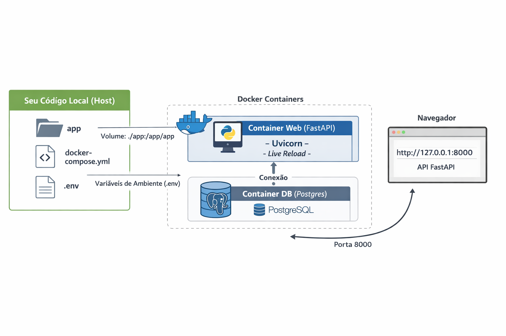

```bash
maintenance-saas/
│
├── app/
│   ├── static/
│   │   └── css/
│   │       └── style.css
│   ├── api/              # Camada de entrada (HTTP)
│   │   └── web/
│   │       └── dashboard.py│          
│   ├── core/             # Configurações e regras centrais
│   ├── domain/           # Entidades de negócio (puras)
│   ├── services/         # Casos de uso
│   ├── infrastructure/  # Banco, segurança, integrações
│   ├── main.py           # Ponto de entrada da aplicação
│   └── templates
│       └── dashboard.html
│ 
├── tests/
│
├── .env.example
├── .gitignore
├── README.md
├── requirements.txt
├── Dockerfile
├── docker-compose.yml
```
# Maintenance SaaS

Sistema SaaS para gestão de manutenção preventiva.

## Stack
- Python
- FastAPI
- PostgreSQL

## Objetivo
Projeto educacional com padrões profissionais.
# Maintenance SaaS

## Arquitetura do Projeto

A seguir, um diagrama mostrando como o código local interage com os containers Docker (Web e DB) e o navegador:



- **Código Local**: Pasta `app` com FastAPI e `.env`.
- **Container Web**: FastAPI rodando com Uvicorn.
- **Container DB**: PostgreSQL.
- **Navegador**: Acessa a aplicação via `http://127.0.0.1:8000`.

## Configuração do Ambiente

Crie o arquivo `.env` a partir do modelo `.env.example`:

```bash
cp .env.example .env
```
Edite o .env com seus valores reais:
```bash
POSTGRES_USER=meu_usuario
POSTGRES_PASSWORD=minha_senha
POSTGRES_DB=meu_banco
```

Rodando com Docker
```bash
docker-compose up --build
```

